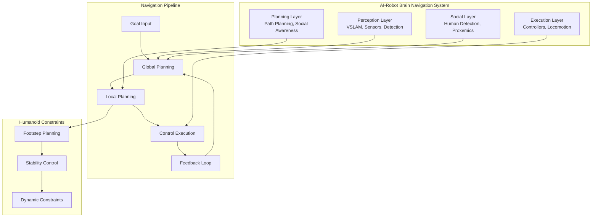

# Chapter 3: Summary - Advanced Navigation with Nav2

## Integration of Vision-Language-Action Systems

This chapter has covered the comprehensive implementation of advanced navigation systems for humanoid robots using the Navigation2 (Nav2) framework. We've explored how to integrate vision-language-action (VLA) systems with navigation to create cognitive robots that can operate effectively in human environments.

### Key Components Integration

The complete AI-robot brain navigation system combines several key components:

1. **Perception Layer**: VSLAM systems for real-time mapping and localization
2. **Planning Layer**: Advanced path planning algorithms including humanoid-aware approaches
3. **Execution Layer**: Humanoid-specific controllers for stable locomotion
4. **Social Layer**: Human-aware navigation respecting proxemics and social norms

### Complete System Architecture



### Implementation Best Practices

When implementing the complete navigation system, consider these best practices:

1. **Modular Design**: Keep each component separate but well-integrated
2. **Real-time Performance**: Optimize algorithms for real-time execution
3. **Safety First**: Always prioritize safety over efficiency
4. **Human-Centric**: Design with human comfort and safety as primary goals
5. **Robustness**: Handle edge cases and failure scenarios gracefully

### Code Integration Example

Here's how to tie together all the components in a complete navigation system:

```cpp
#include <rclcpp/rclcpp.hpp>
#include <nav2_behavior_tree/bt_action_server.hpp>
#include <nav2_msgs/action/navigate_to_pose.hpp>
#include <nav2_vslam/vslam_component.hpp>
#include <nav2_social_navigation/social_components.hpp>
#include <nav2_path_planning/path_planners.hpp>
#include <nav2_locomotion/humanoid_controller.hpp>

class IntegratedNavigationSystem : public rclcpp::Node
{
public:
  IntegratedNavigationSystem() : Node("integrated_navigation_system")
  {
    // Initialize all components
    vslam_system_ = std::make_shared<nav2_vslam::VSLAMComponent>(get_node_options());
    social_detector_ = std::make_shared<nav2_social_navigation::HumanDetectorTracker>(get_node_options());
    path_planner_ = std::make_shared<nav2_path_planning::HumanoidAwarePlanner>();
    controller_ = std::make_shared<nav2_locomotion::HumanoidController>(get_node_options());

    // Initialize navigation action server
    bt_action_server_ = std::make_unique<nav2_behavior_tree::BtActionServer<nav2_msgs::action::NavigateToPose>>(
      get_node_base_interface(),
      get_node_action_interface(),
      get_node_logging_interface(),
      get_node_waitables_interface(),
      "navigate_to_pose",
      std::bind(&IntegratedNavigationSystem::navigateToPose, this, std::placeholders::_1),
      std::bind(&IntegratedNavigationSystem::navigateToPoseFeedback, this, std::placeholders::_1)
    );

    // Setup parameter updates
    setupParameterCallbacks();

    RCLCPP_INFO(get_logger(), "Integrated Navigation System initialized successfully");
  }

private:
  // Component pointers
  std::shared_ptr<nav2_vslam::VSLAMComponent> vslam_system_;
  std::shared_ptr<nav2_social_navigation::HumanDetectorTracker> social_detector_;
  std::shared_ptr<nav2_path_planning::HumanoidAwarePlanner> path_planner_;
  std::shared_ptr<nav2_locomotion::HumanoidController> controller_;
  std::unique_ptr<nav2_behavior_tree::BtActionServer<nav2_msgs::action::NavigateToPose>> bt_action_server_;

  // Main navigation function
  rclcpp_action::GoalResponse navigateToPose(const rclcpp_action::GoalUUID & uuid,
                                            std::shared_ptr<const nav2_msgs::action::NavigateToPose::Goal> goal)
  {
    // Check if goal is valid and reachable
    if (!isGoalValid(goal->pose)) {
      return rclcpp_action::GoalResponse::REJECT;
    }

    // Integrate VSLAM for current map
    auto current_map = vslam_system_->getCurrentMap();

    // Detect and track humans in environment
    auto humans = social_detector_->getTrackedHumans();

    // Plan path considering social constraints
    auto path = path_planner_->createSociallyAwarePlan(
      getCurrentPose(), goal->pose, humans, current_map);

    if (path.poses.empty()) {
      return rclcpp_action::GoalResponse::REJECT;
    }

    return rclcpp_action::GoalResponse::ACCEPT_AND_EXECUTE;
  }

  // Feedback callback for navigation progress
  rclcpp_action::GoalResponse navigateToPoseFeedback(
    std::shared_ptr<nav2_msgs::action::NavigateToPose::Impl::FeedbackMessage> feedback)
  {
    // Monitor human positions during navigation
    auto current_humans = social_detector_->getTrackedHumans();

    // Replan if humans move into path
    if (shouldReplanForHumans(current_humans)) {
      // Trigger replanning with new social constraints
      triggerReplanning(current_humans);
    }

    // Monitor robot stability
    if (!controller_->isStable()) {
      // Execute recovery behavior
      executeRecoveryBehavior();
    }
  }

  bool isGoalValid(const geometry_msgs::msg::PoseStamped& goal) {
    // Check if goal is in traversable area
    // Check for dynamic obstacles
    // Check social constraints
    return true; // Simplified for example
  }

  bool shouldReplanForHumans(const std::vector<HumanDetection>& humans) {
    // Determine if human positions require replanning
    // This could be based on distance, predicted paths, etc.
    return false; // Simplified for example
  }

  void triggerReplanning(const std::vector<HumanDetection>& humans) {
    // Cancel current navigation
    // Plan new path considering human positions
    // Resume navigation
  }

  void executeRecoveryBehavior() {
    // Execute predefined recovery behaviors
    // Stop, stabilize, assess situation
  }

  void setupParameterCallbacks() {
    // Setup callbacks for dynamic parameter updates
    // Allow runtime adjustment of social parameters
    // Allow runtime adjustment of planning parameters
  }
};

int main(int argc, char ** argv)
{
  rclcpp::init(argc, argv);

  auto system = std::make_shared<IntegratedNavigationSystem>();

  RCLCPP_INFO(system->get_logger(), "Starting Integrated Navigation System");

  rclcpp::spin(system);
  rclcpp::shutdown();

  return 0;
}
```

### Performance Optimization

For optimal performance of the integrated system:

1. **Threading**: Use separate threads for perception, planning, and control
2. **Caching**: Cache maps and frequently accessed data
3. **Prediction**: Use predictive models for human movement
4. **Prioritization**: Prioritize critical safety tasks over optimization

### Testing and Validation

Comprehensive testing should include:

1. **Unit Tests**: Individual component testing
2. **Integration Tests**: Component interaction testing
3. **System Tests**: Full system validation
4. **Field Tests**: Real-world scenario testing
5. **Stress Tests**: Edge case and failure scenario testing

### Future Enhancements

Consider these enhancements for future development:

1. **Learning-Based Navigation**: Incorporate machine learning for adaptive behavior
2. **Multi-Robot Coordination**: Extend to multi-robot scenarios
3. **Advanced Social Models**: More sophisticated human behavior modeling
4. **Haptic Feedback**: Integration with haptic systems for physical interaction

## Conclusion

The AI-robot brain navigation system represents a significant advancement in humanoid robotics, combining state-of-the-art perception, planning, and control with social awareness. By implementing the concepts and code examples provided in this chapter, you can create humanoid robots that navigate safely and naturally in human-populated environments.

The integration of vision-language-action systems with navigation enables robots to understand and respond to complex environmental contexts, making them suitable for real-world deployment in homes, offices, and public spaces. The modular architecture allows for continuous improvement and adaptation to new requirements and environments.