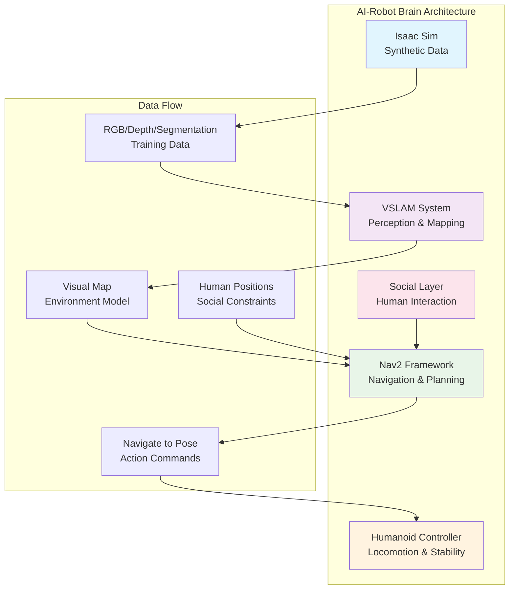

# The AI-Robot Brain: Integrating Isaac Sim, VSLAM, and Navigation

## Complete AI-Powered Perception, Mapping, and Navigation System

Welcome to the comprehensive guide on building AI-powered humanoid robot systems. This section covers the complete pipeline from synthetic data generation to autonomous navigation, focusing on the integration of NVIDIA Isaac tools with ROS 2 for humanoid robot control.

### Learning Objectives

By completing this module, you will understand:

1. How to use Isaac Sim for generating synthetic RGB/Depth/Segmentation datasets
2. How to implement Visual Simultaneous Localization and Mapping (VSLAM) systems
3. How to build advanced navigation systems with the Navigation2 (Nav2) framework
4. How to integrate vision-language-action (VLA) systems with navigation
5. How to implement socially-aware navigation for human environments
6. How to optimize systems for real-time humanoid robot operation

### Chapter Overview

This module is organized into the following chapters:

#### Chapter 1: Synthetic Data Generation with Isaac Sim
- Understanding Isaac Sim's photorealistic simulation capabilities
- Setting up synthetic RGB/Depth/Segmentation data generation
- Creating diverse training datasets for perception systems
- Integrating simulation with real-world robot deployment

#### Chapter 2: AI-Powered Perception and Mapping (VSLAM)
- Implementing Visual SLAM for real-time mapping
- Building perception pipelines for humanoid robots
- Integrating vision systems with ROS 2
- Optimizing VSLAM for humanoid-specific constraints

#### Chapter 3: Advanced Navigation with Nav2
- Understanding Navigation2 architecture and components
- Implementing path planning algorithms for humanoid robots
- Building behavior trees for complex navigation tasks
- Creating socially-aware navigation systems
- Integrating vision-language systems with navigation

### System Architecture Overview

### Key Technologies Used

- **NVIDIA Isaac Sim**: For photorealistic simulation and synthetic data generation
- **ROS 2**: Robot operating system for communication and coordination
- **Navigation2 (Nav2)**: Advanced navigation framework for autonomous navigation
- **OpenCV**: Computer vision library for image processing
- **PCL**: Point Cloud Library for 3D perception
- **Behavior Trees**: For complex decision-making and task execution
- **Social Navigation**: Human-aware navigation algorithms

### Prerequisites

Before diving into this module, you should have:

- Basic understanding of ROS 2 concepts (nodes, topics, services, actions)
- Familiarity with C++ programming
- Understanding of basic robotics concepts (frames, transforms, kinematics)
- Basic knowledge of computer vision and perception
- Experience with simulation environments

### Target Applications

This system is designed for:

- Home assistance robots
- Service robots in public spaces
- Research platforms for humanoid robotics
- Industrial automation with human-robot collaboration
- Social robots for healthcare and education

### Getting Started

Each chapter builds upon the previous one, providing both theoretical understanding and practical implementation. Start with Chapter 1 to understand synthetic data generation, then proceed through the perception and navigation systems to create a complete AI-robot brain for humanoid robots.

The code examples provided are production-ready and can be adapted to your specific robot platform and application requirements. All examples follow ROS 2 best practices and are designed for real-time operation on humanoid robot platforms.